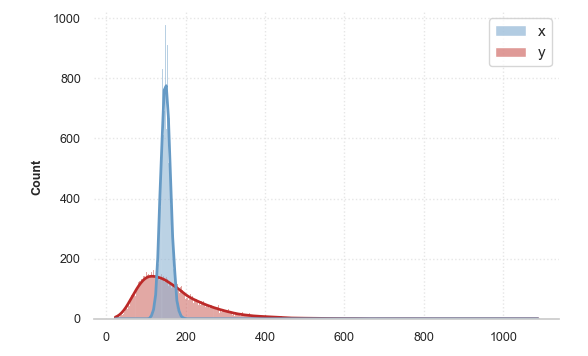
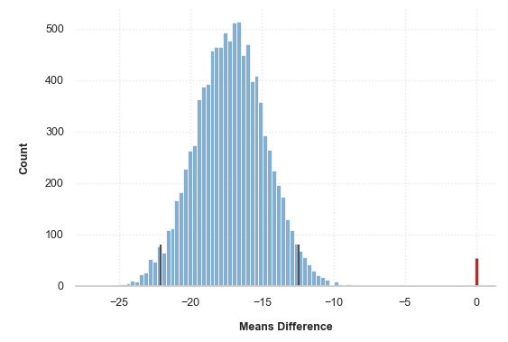
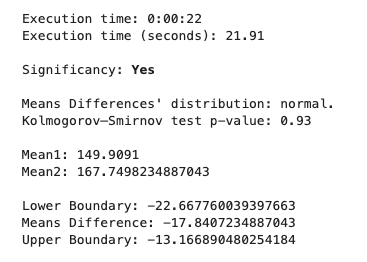
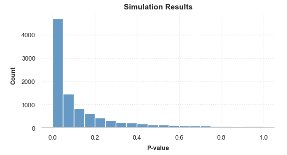
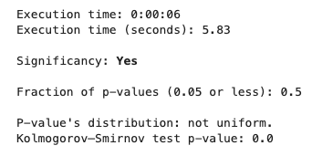
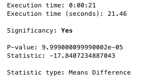

## Статистические тесты

### Данные

С помощью numpy сгенерированы распределение Пуассона (x) и логнормальное распределение (y).

Число элементов: 10000;  
Среднее значение x: ~150;  
Среднее значение y: ~170.

### Poisson Bootstrap

Проверка гипотезы о различии общегрупповых средних.

**Нулевая гипотеза**: отличия в общегрупповых средних статистически не значимы.

После 10000 симуляций получаем следующее распределение разности средних.

Серыми вертикальными линиями показаны 2,5 и 97,5 процентили.

Разности общегрупповых средних распределены нормально, что подтверждает критерий Колмогорова-Смирнова (p = 0.93). Нулевое значение выходит за рамки границ, обозначенных 2,5 и 97,5 процентилем. Это является основанием отвергнуть нулевую гипотезу.

**Вывод:** Различия в общегрупповых средних статистически значимы.

### Симуляции t-test

Проверка гипотезы о различии общегрупповых средних.

**Нулевая гипотеза**: отличия в общегрупповых средних статистически не значимы.

После 10000 симуляций t-test получаем следующее распределение p-value.

Критерий Колмогорова-Смирнова показывает, что данное распределение p-значений значимо отличается от непрерывного равномерного распределения (p = 0). Доля p-значений ниже 0.05 в этом распределении составляет 47% - нулевая гипотеза отвергается.

**Вывод:** Различия в общегрупповых средних статистически значимы.

### Permutation Test

Проверка гипотезы о различии общегрупповых средних.

**Нулевая гипотеза**: отличия в общегрупповых средних статистически не значимы.

Перестановочный тест показывает, что общегрупповые средние отличаются статистически значимо (p-value=1e-4). 

**Вывод:** Различия в общегрупповых средних статистически значимы.